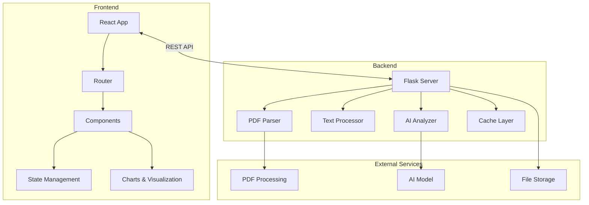
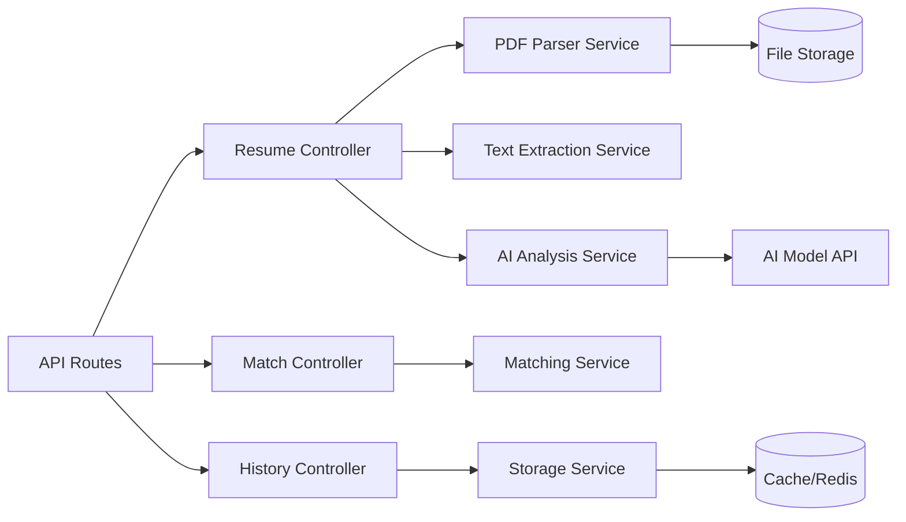

# AI 赋能的智能简历分析系统 - 技术架构文档

## 1. Architecture Design



## 2. Technology Description

- **Frontend**: React@18 + TypeScript + TailwindCSS@3 + Vite
- **Frontend Libraries**: 
  - react-router-dom@6 (路由管理)
  - lucide-react (图标库)
  - recharts (数据可视化)
  - framer-motion (动画)
  - zustand (状态管理)
  - react-dropzone (文件上传)
- **Backend**: Python + Flask
- **Backend Libraries**:
  - PyPDF2 / pdfplumber (PDF 解析)
  - python-dotenv (环境变量)
  - flask-cors (跨域支持)
  - redis (缓存)
- **AI Integration**: OpenAI API / 本地 LLM 模拟
- **Deployment**: GitHub Pages (前端) + 阿里云 Serverless (后端)

## 3. Route Definitions

| Route | Purpose |
|-------|---------|
| / | 重定向到 /home |
| /home | 首页 - 功能介绍和快速入口 |
| /home/analyze | 简历分析 - 上传并分析单个简历 |
| /home/compare | 简历比较 - 对比分析两份简历 |
| /home/history | 历史记录 - 管理分析历史 |
| /home/match | 岗位匹配 - 匹配岗位与简历 |

## 4. API Definitions

### 4.1 Type Definitions

```typescript
interface ResumeData {
    id: string;
    filename: string;
    uploadedAt: string;
    basicInfo: {
        name: string;
        phone: string;
        email: string;
        address: string;
    };
    jobInfo: {
        position: string;
        expectedSalary: string;
    };
    background: {
        workYears: string;
        education: string;
        projects: string[];
    };
    skills: string[];
    scores: {
        overall: number;
        skills: number;
        experience: number;
        education: number;
    };
    analysis: string;
}

interface MatchRequest {
    jobDescription: string;
    requirements: string;
    resumes: string[];
}

interface MatchResult {
    resumeId: string;
    matchScore: number;
    details: {
        skillsMatch: number;
        experienceMatch: number;
        educationMatch: number;
    };
    highlights: string[];
}
```

### 4.2 API Endpoints

#### 简历上传与分析
```
POST /api/resume/upload
Content-Type: multipart/form-data
Request: { file: PDF file }
Response: { id: string, filename: string, status: 'processing' }

GET /api/resume/:id
Response: ResumeData

POST /api/resume/analyze
Request: { id: string }
Response: ResumeData
```

#### 简历比较
```
POST /api/resume/compare
Request: { resumeIds: [string, string] }
Response: {
    resumes: [ResumeData, ResumeData],
    comparison: {
        overallDiff: number,
        strengths: { [resumeId]: string[] },
        weaknesses: { [resumeId]: string[] },
        recommendation: string
    }
}
```

#### 岗位匹配
```
POST /api/match
Request: MatchRequest
Response: { matches: MatchResult[] }
```

#### 历史记录
```
GET /api/history
Response: ResumeData[]

DELETE /api/history/:id
Response: { success: boolean }
```

## 5. Server Architecture Diagram



## 6. Data Model

### 6.1 Data Storage

使用本地文件存储和内存缓存（生产环境使用 Redis）

#### Resume History Store
```typescript
interface HistoryStore {
    resumes: Map<string, ResumeData>;
    add(resume: ResumeData): void;
    get(id: string): ResumeData | undefined;
    getAll(): ResumeData[];
    delete(id: string): boolean;
    clear(): void;
}
```

### 6.2 File Structure

```
/workspace
├── frontend/
│   ├── src/
│   │   ├── components/
│   │   │   ├── Navbar.tsx
│   │   │   ├── ResumeUploader.tsx
│   │   │   ├── ResumeCard.tsx
│   │   │   ├── ScoreChart.tsx
│   │   │   └── ComparisonView.tsx
│   │   ├── pages/
│   │   │   ├── Home.tsx
│   │   │   ├── Analyze.tsx
│   │   │   ├── Compare.tsx
│   │   │   ├── History.tsx
│   │   │   └── Match.tsx
│   │   ├── hooks/
│   │   │   └── useResumeStore.ts
│   │   ├── utils/
│   │   │   └── api.ts
│   │   ├── App.tsx
│   │   └── main.tsx
│   ├── package.json
│   └── vite.config.ts
├── backend/
│   ├── src/
│   │   ├── app.py
│   │   ├── parser/
│   │   │   ├── pdf_parser.py
│   │   │   └── text_extractor.py
│   │   ├── analyzer/
│   │   │   ├── resume_analyzer.py
│   │   │   └── matcher.py
│   │   ├── storage/
│   │   │   └── history_store.py
│   │   └── utils/
│   │       └── cache.py
│   ├── requirements.txt
│   └── .env.example
└── README.md
```
