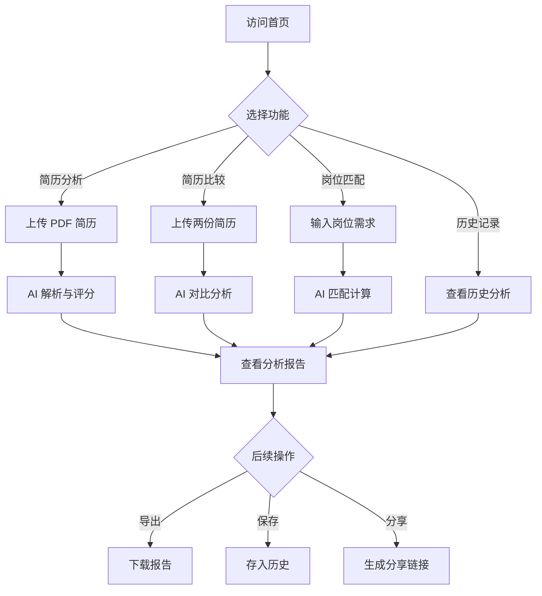

# AI 赋能的智能简历分析系统 - 产品需求文档

## 1. Product Overview

AI 赋能的智能简历分析系统，帮助招聘人员快速筛选和分析大量简历，自动解析 PDF 简历，提取关键信息，并利用 AI 模型进行评分和关键词匹配。

- 解决招聘流程中简历筛选耗时耗力的问题，提高招聘效率
- 目标用户：企业招聘人员、HR 专员、猎头顾问
- 市场价值：自动化简历处理，降低人力成本，提升招聘质量

## 2. Core Features

### 2.1 User Roles

| Role | Registration Method | Core Permissions |
|------|---------------------|------------------|
| 招聘人员 | 无需注册 | 使用所有功能，上传简历、分析、比较、导出 |

### 2.2 Feature Module

1. **首页 (/home)**: 导航栏、功能介绍、快速入口
2. **简历上传解析 (/home/analyze)**: 上传 PDF 简历、提取关键信息、AI 评分
3. **简历比较 (/home/compare)**: 上传两份简历、对比分析、综合评分
4. **简历管理 (/home/history)**: 历史记录、批量管理、搜索筛选
5. **岗位匹配 (/home/match)**: 输入岗位要求、匹配简历、排序推荐

### 2.3 Page Details

| Page Name | Module Name | Feature description |
|-----------|-------------|---------------------|
| 首页 | 导航栏 | Logo、页面导航、主题切换 |
| 首页 | 功能介绍 | 核心功能展示、使用流程说明 |
| 首页 | 快速入口 | 一键进入各个功能模块 |
| 简历分析 | 文件上传 | 拖拽上传、文件选择、PDF 格式校验 |
| 简历分析 | 信息提取 | 姓名、电话、邮箱、地址、求职意向、工作年限、学历背景 |
| 简历分析 | AI 评分 | 技能匹配度、工作经验相关性、综合评分 |
| 简历分析 | 结果展示 | 信息卡片、评分雷达图、详细分析报告 |
| 简历比较 | 双上传区域 | 同时上传两份简历进行对比 |
| 简历比较 | 对比分析 | 信息并排显示、差异高亮、维度对比 |
| 简历比较 | 综合评估 | 总分对比、优势劣势分析、推荐建议 |
| 简历管理 | 历史列表 | 卡片式展示、时间排序、状态标识 |
| 简历管理 | 搜索筛选 | 关键词搜索、分数范围、日期筛选 |
| 简历管理 | 批量操作 | 批量删除、批量导出、批量比较 |
| 岗位匹配 | 需求输入 | 岗位描述、技能要求、经验要求 |
| 岗位匹配 | 简历匹配 | 自动匹配历史简历、计算匹配度、排序展示 |
| 岗位匹配 | 推荐结果 | 匹配度排行、详细分析、一键联系 |

## 3. Core Process

用户访问系统 → 选择功能模块 → 上传简历/输入需求 → AI 分析处理 → 查看结果报告 → 导出或保存

## 4. User Interface Design

### 4.1 Design Style

- **主色调**: 深蓝 #1e3a5f，科技感与专业感
- **辅助色**: 青绿色 #10b981（成功/高分）、橙黄色 #f59e0b（警告/中等）、红色 #ef4444（危险/低分）
- **按钮风格**: 圆角矩形、轻微阴影、悬停上浮效果
- **字体**: Inter 作为主字体，清晰现代，标题使用较大字号和字重
- **布局风格**: 卡片式布局，清晰的视觉层级，充足的留白
- **图标**: Lucide React 图标库，线性风格，保持一致性
- **整体风格**: 现代、专业、科技感，适合企业级应用

### 4.2 Page Design Overview

| Page Name | Module Name | UI Elements |
|-----------|-------------|-------------|
| 首页 | Hero 区域 | 大标题、副标题、CTA 按钮、渐变背景、微动画 |
| 首页 | 功能卡片 | 图标、标题、描述、悬停效果、3 列网格 |
| 简历分析 | 上传区域 | 大虚线框、拖放提示、文件图标、进度条 |
| 简历分析 | 结果卡片 | 个人信息头像、关键数据网格、评分仪表盘 |
| 简历比较 | 对比面板 | 左右分栏、同步滚动、差异高亮颜色标记 |
| 简历管理 | 数据表格 | 搜索栏、筛选器、分页、卡片/列表视图切换 |
| 通用 | 导航栏 | 固定顶部、Logo、导航链接、用户菜单、深色模式切换 |
| 通用 | 侧边栏 | 功能菜单、折叠动画、当前页高亮 |

### 4.3 Responsiveness

- Desktop-first 设计，适配 1024px 及以上屏幕
- 平板适配：768px - 1024px，调整网格布局
- 移动端适配：375px - 768px，堆叠布局，简化界面
- 触摸优化：按钮最小 44px，合理的触摸间距

### 4.4 Animation & Interaction

- 页面加载：元素渐入动画，延迟错开显示
- 按钮交互：悬停上浮、点击缩放、颜色过渡
- 卡片交互：悬停阴影加深、轻微上浮
- 数据可视化：评分图表动画加载
- 上传反馈：进度条动画、成功/失败状态提示
